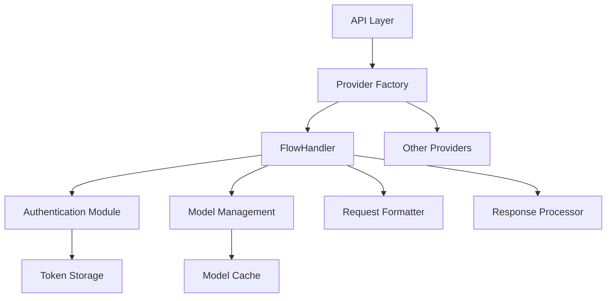

# System Patterns: Roo-Code Architecture

## Core Architecture Patterns

### Provider Pattern
O sistema utiliza um padrão de Provider extensível onde cada provedor de IA implementa interfaces padronizadas:

```typescript
interface BaseProvider {
  getModels(): Promise<ModelInfo[]>;
  getModelById(id: string): ModelInfo | undefined;
  // ... outros métodos
}

interface SingleCompletionHandler {
  handleSingleCompletion(request: CompletionRequest): Promise<CompletionResponse>;
  // ... outros métodos
}
```

### Key Design Decisions

#### 1. Interface Segregation
- **BaseProvider**: Gerenciamento de modelos e metadados
- **SingleCompletionHandler**: Processamento de completions
- **Separation of Concerns**: Cada interface tem responsabilidade específica

#### 2. Factory Pattern
- Providers são registrados e instanciados através de factory
- Permite adição dinâmica de novos providers
- Configuração centralizada em `src/api/index.ts`

#### 3. Cache Strategy
- **Model Cache**: Cache local de modelos com TTL
- **Token Cache**: Cache de tokens de autenticação em memória
- **Invalidation**: Estratégias de invalidação baseadas em tempo e eventos

### Component Relationships



### File Organization Pattern

```
src/
├── api/
│   ├── providers/
│   │   ├── flow.ts              # FlowHandler implementation
│   │   ├── fetchers/
│   │   │   └── modelCache.ts    # Model caching system
│   │   └── index.ts             # Provider exports
│   └── index.ts                 # Provider registration
├── shared/
│   └── api.ts                   # Shared types and utilities
└── types/
    └── flow.ts                  # Flow-specific types
```

## Implementation Patterns

### Error Handling Pattern
```typescript
try {
  const result = await apiCall();
  return result;
} catch (error) {
  logger.error('Operation failed', { error, context });
  throw new ProviderError('Specific error message', error);
}
```

### Authentication Pattern
```typescript
class FlowHandler {
  private token?: string;
  private tokenExpiry?: Date;
  
  private async ensureAuthenticated(): Promise<string> {
    if (this.isTokenValid()) {
      return this.token!;
    }
    return await this.refreshToken();
  }
}
```

### Model ID Pattern
- **Format**: `provider:originalModelId`
- **Examples**: 
  - `azure-openai:gpt-4`
  - `gemini:gemini-pro`
  - `bedrock:claude-3-sonnet`

### Request Formatting Pattern
```typescript
private formatRequest(provider: string, request: CompletionRequest): any {
  switch (provider) {
    case 'azure-openai':
      return this.formatOpenAIRequest(request);
    case 'gemini':
      return this.formatGeminiRequest(request);
    case 'bedrock':
      return this.formatBedrockRequest(request);
    default:
      throw new Error(`Unsupported provider: ${provider}`);
  }
}
```

## Testing Patterns

### Unit Testing
- **Mocking**: External API calls são mockados
- **Isolation**: Cada método testado independentemente
- **Coverage**: Foco em edge cases e error paths

### Integration Testing
- **Real APIs**: Testes com APIs reais em ambiente de desenvolvimento
- **End-to-End**: Fluxos completos de autenticação → busca de modelos → completion
- **Error Scenarios**: Testes de falhas de rede, tokens expirados, etc.

## Configuration Patterns

### Environment-based Configuration
```typescript
interface FlowProviderOptions {
  flowBaseUrl?: string;          // Default: production URL
  flowTenant: string;            // Required
  flowClientId: string;          // Required
  flowClientSecret: string;      // Required
  flowAppToAccess?: string;      // Optional
  flowModelId?: string;          // Optional default model
}
```

### Validation Pattern
- **Required Fields**: Validação na inicialização
- **Format Validation**: URLs, IDs, etc.
- **Runtime Validation**: Tokens, responses da API
